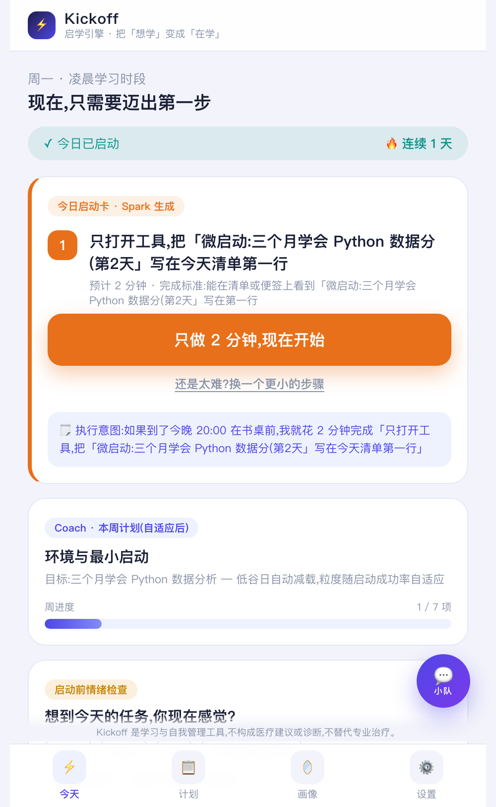
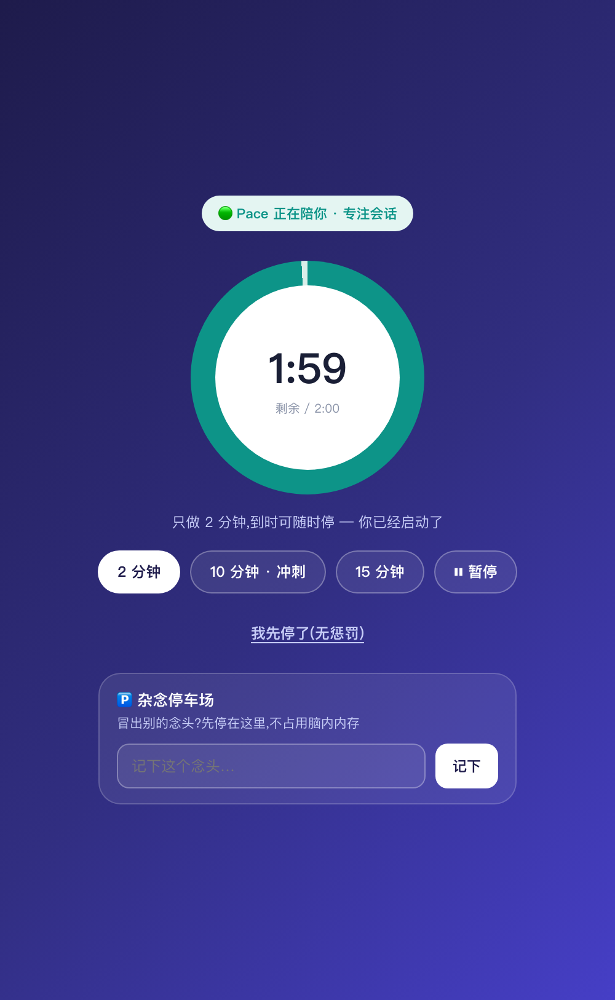
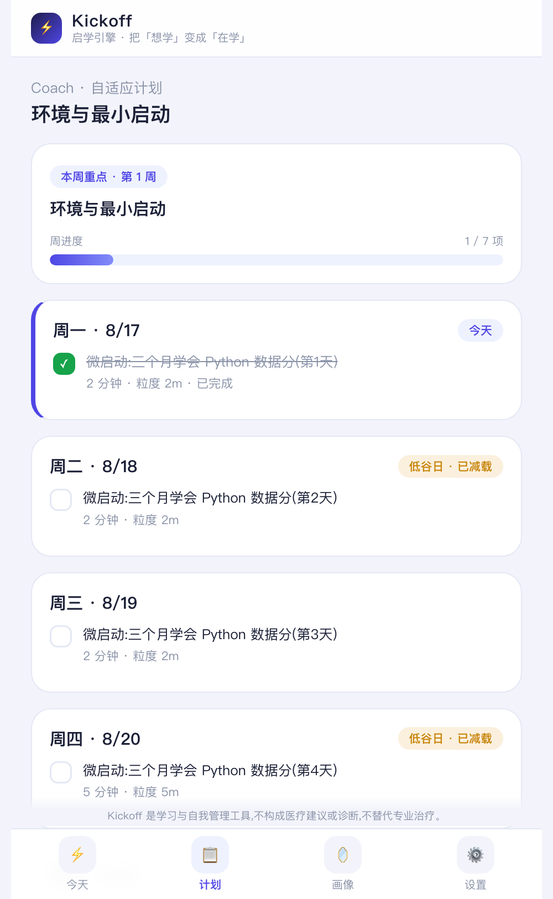
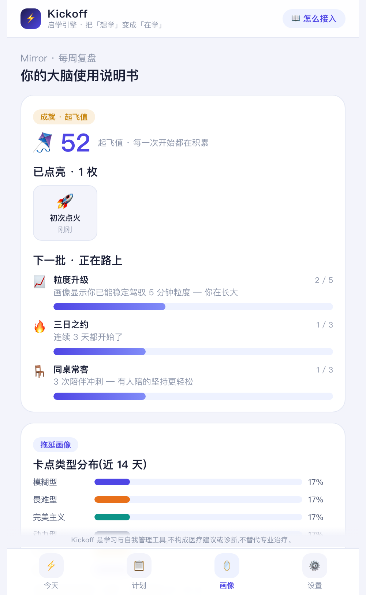
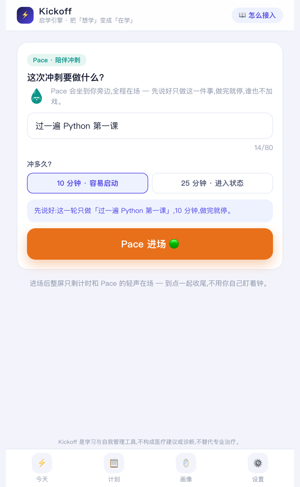
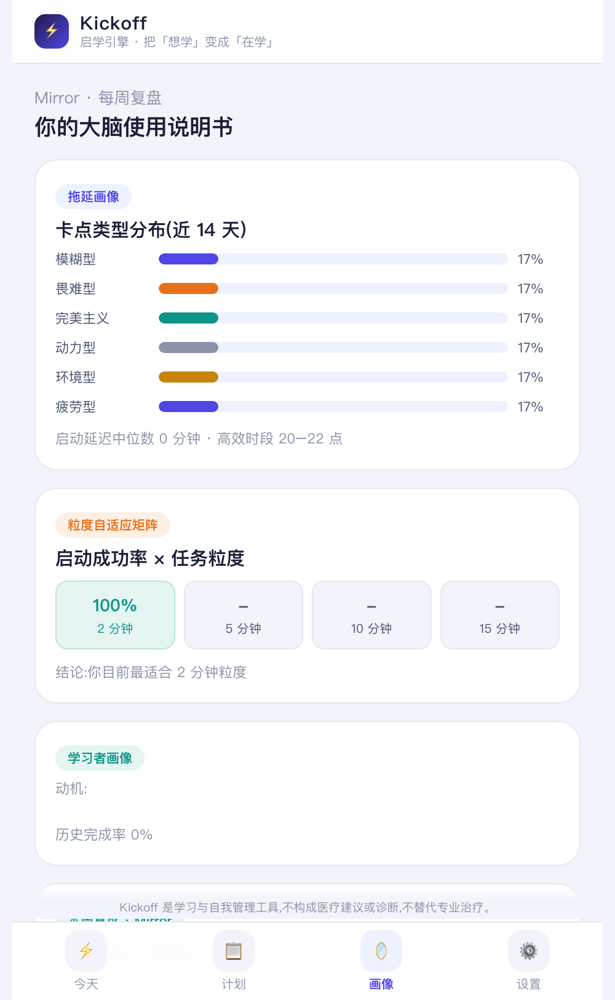
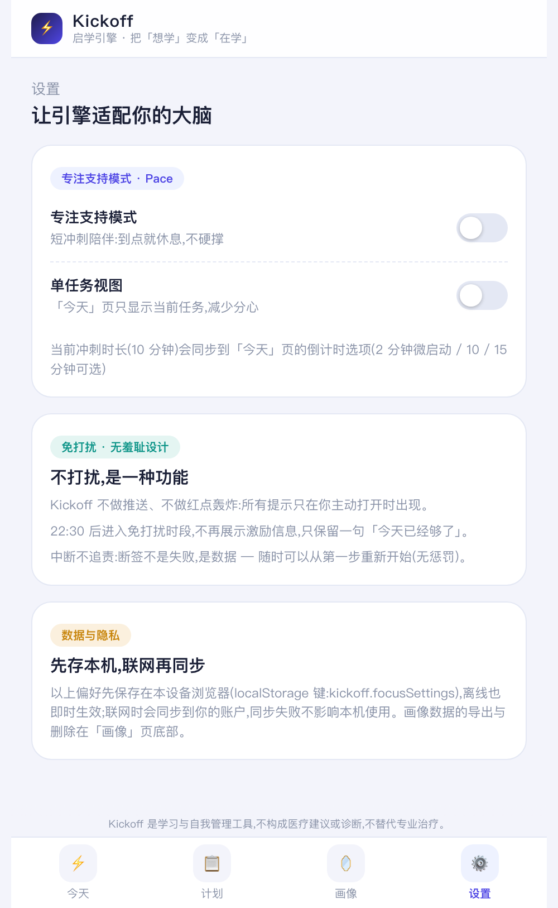

<div align="center">


# Kickoff · 启学引擎

**把「想学」变成「在学」,把「在学」变成「学成」。**

面向拖延者与 ADHD 倾向自学者的多 Agent 学习启动引擎

四职能 Agent × 双画像记忆 × 循证行为干预 · Next.js PWA + Electron 桌面伴侣 + 微信小程序

</div>

---

## 这是什么

自学失败的主因不是「没资源」,是「没行动」——在线课程完成率长期不足 10%。Kickoff 不做内容平台,只解决**行为层**:启动、坚持、复盘。

一个真实用户的完整闭环:

> 写下目标(可粘贴你自己的视频/教材/线下要点)→ Coach 生成专属路线 → **今天只剩一个 2 分钟的第一步** → 计时冲刺(Pace 陪伴)→ 打卡 → Mirror 复盘 → 画像更新 → **计划自动调整** → 越用越懂你。

## 功能速览(真实系统截图)

### 🚀 启动:把大象装进冰箱

| | |
|---|---|
|  | **今日启动卡**:任何时候打开,只有一个 ≤2 分钟、确定能完成的动作。觉得难?「换更小的步骤」可无限降档。状态条实时显示「✓ 今日已启动 · 🔥 连续 N 天」。 |
|  | **可视化倒计时 + 杂念停车场**:时间是看得见的(ADHD「时间盲视」对策);计时中冒出的杂念一键记下——写下来,大脑就能放下。 |

### 📚 规划:任何技能,带上你的资源

| | |
|---|---|
|  | **周计划视图**:首周自动「最低可持续」压载;低谷日自动减载;任务可携带你自己的教程/视频链接(📎 一键直达)。 |
|  | **无羞耻成就系统**:十项成就 + 起飞值,只庆祝「开始与回来」——包括为断签后重新开始颁发的「💫 王者归来」。 |

### 🧘 陪伴与复盘:有人陪你,越用越懂你

| | |
|---|---|
|  | **AI Body Doubling 陪伴冲刺**:Pace(那颗呼吸着的青色水滴)开场互报目标、进行中轻声在场、结束双问——他人在场就能提升任务启动(body doubling),而它没有陌生人、没有社交异化。 |
|  | **四 Agent 小队对话**:猫头鹰 Coach(规划)、火箭 Spark(拆解)、水滴 Pace(陪伴)、星星 Mirror(复盘),各有可爱动态形象,意图路由自动应答。 |
|  | **双画像 × 粒度自适应**:拖延画像(六型卡点分布)+ 学情画像;任务粒度(2→5→10→15 分钟)随你的真实启动成功率自动升降——因材施教,落在可计算的机制上。 |

<details>
<summary>更多截图(设置 / 教程)</summary>

| | |
|---|---|
|  | 专注支持模式(账户级)+ 主动邀约通知 + 常驻免责声明 |
|  | 页头常驻「📖 怎么接入」三步教程:目标写法 / 三类资源 / 生成后用法 |

</details>

## 设计背后的科学

本产品的每个核心机制都有行为科学/心理学依据,并在产品内**如实标注证据强度**。

| 产品机制 | 行为科学依据 | 证据强度 |
|---|---|---|
| 2 分钟启动卡 / 微步骤拆解 | 微习惯与行为激活:把行为缩小到「小到不可能失败」(Fogg, *Tiny Habits*);任务启动是执行功能中最先失守的一环(Barkley, 1997) | 强 / 强 |
| 提醒即「如果-那么」执行意图 | 执行意图元分析:94 项研究,效应量 **d = 0.65**(Gollwitzer & Sheeran, 2006, *Advances in Experimental Social Psychology*) | 强 |
| 启动前情绪检查 | 拖延的本质是**短期情绪修复**压过长期目标,而非时间管理失败(Sirois & Pychyl, 2013, *Social and Personality Psychology Compass*) | 强 |
| 「烂开始」反完美主义 | 元分析:**完美主义担忧**(怕做不好)与拖延正相关,高标准本身不导致拖延(Sirois, Molnar & Hirsch, 2017, *European Journal of Personality*) | 强 |
| 无羞耻设计 / 断签自动宽恕 / Fresh Start | 自我关怀与拖延负相关 r≈-.38(Sirois, 2014);**自我原谅显著减少后续拖延**(Wohl, Pychyl & Bennett, 2010, *Personality and Individual Differences*);时间地标触发重新开始(Dai, Milkman & Riis, 2014, *Management Science*) | 强 |
| 时间可视化倒计时 | ADHD「时间盲视」的对策是**外部化**:把时间从头脑移到看得见的环境(Barkley, ADHD 执行功能模型) | 强(模型核心) |
| 即时奖励 / 起飞值 / 成就 | ADHD 与拖延人群对延迟奖励折扣更陡(元分析:Jackson & MacKillop, 2016, *Psychological Research*);对策是缩短「努力→奖励」延迟 | 强 |
| AI 陪伴冲刺(body doubling) | 他人在场即可提升动机与任务启动,**远程同样有效**(Eagle et al., 2024, *ACM TOCHI*) | 中 |
| 杂念停车场 | 未完成任务制定具体计划后即停止侵入性占用工作记忆(Masicampo & Baumeister, 2011, *JPSP*) | 中 |
| 兴趣/新奇/紧迫动机开关 | 兴趣驱动神经系统(ICNU)框架(Dodson, *ADDitude*)——临床经验框架,产品内如实标注 | 弱-社区经验 |

**关键参考文献**

1. Steel, P. (2007). The nature of procrastination: A meta-analytic and theoretical review. *Psychological Bulletin, 133*(1), 65–94.
2. Gollwitzer, P. M., & Sheeran, P. (2006). Implementation intentions and goal achievement: A meta-analysis. *Advances in Experimental Social Psychology, 38*, 69–119.
3. Sirois, F., & Pychyl, T. (2013). Procrastination and the priority of short-term mood regulation. *Social and Personality Psychology Compass, 7*(9), 675–690.
4. Sirois, F., Molnar, D., & Hirsch, J. (2017). A meta-analytic and conceptual update on the associations between procrastination and multidimensional perfectionism. *European Journal of Personality, 31*(4), 382–403.
5. Wohl, M., Pychyl, T., & Bennett, S. (2010). I forgive myself, now I can study: How self-forgiveness for procrastinating can reduce future procrastination. *Personality and Individual Differences, 48*(7), 802–808.
6. Dai, H., Milkman, K., & Riis, J. (2014). The fresh start effect. *Management Science, 60*(10), 2563–2582.
7. Masicampo, E., & Baumeister, R. (2011). Consider it done! Plan making can eliminate the cognitive effects of unfulfilled goals. *Journal of Personality and Social Psychology, 101*(4), 667–683.
8. Jackson, J., & MacKillop, J. (2016). Attention-deficit/hyperactivity disorder and monetary delay discounting: A meta-analysis. *Psychological Research, 80*, 1197–1206.
9. Eagle, L., et al. (2024). The impact of body doubling on task initiation and completion in neurodivergent adults. *ACM Transactions on Computer-Human Interaction.*
10. Barkley, R. (1997). *ADHD and the nature of self-control.* Guilford Press.

## 快速开始

### Web 内核(必先启动)

```bash
cp .env.example .env   # 不配模型 Key 也可全功能运行(内置确定性 Mock)
npm install
npm run db:push
npm run build && npm run start   # http://localhost:3000
```

配置真实模型:在 `.env` 填 `OPENAI_API_KEY`(OpenAI 兼容接口,DeepSeek/Qwen/GLM 可切换)。

### 桌面伴侣(menubar)

```bash
cd desktop && npm install && npm start   # 需 Web 内核先行
```

菜单栏常驻倒计时 · `Shift+Cmd+K` 全局杂念停车场 · `Shift+Cmd+J` 全局快速启动 · 冲刺完成系统通知。

### 微信小程序

微信开发者工具导入 `wechat/` 目录(详情→本地设置→勾选「不校验合法域名」);`config.js` 里改服务器地址。上线需注册主体 + https 备案域名(详见 `wechat/README.md`)。

### 评测

```bash
npm run sim:gen && npm run eval   # 3 画像×30 天模拟数据 → 四指标+三消融 → eval/report.md
```

## 架构:一核两触点

```
                    ┌────────────────────────┐
   浏览器 PWA ──────►│   Next.js 14 内核       │◄────── Electron 桌面伴侣
  (可安装/离线队列)   │  · 四 Agent 意图路由     │◄────── 微信小程序
                    │  · 双画像记忆引擎         │        (同一套 API)
                    │  · 重规划(复盘→自动落库)  │
                    │  · 循证策略库+Skill Pack  │
                    │  · Prisma/SQLite         │
                    └────────────────────────┘
```

三端共用同一 API 与数据库:网页上打了卡,桌面端的今日任务立刻变化。部署见 [DEPLOY.md](DEPLOY.md)(含 ¥0 的 Cloudflare Tunnel 方案)。

## 伦理与边界

- 本产品是**学习与自我管理工具**,不构成医疗建议或诊断,**不替代专业治疗**;
- 对话检测到自伤等危机信号时,停止普通流程,转介心理援助热线(12356 等);
- 面向 18+ 成人;数据可查看/导出/一键删除,详见 [docs/数据与合规.md](docs/数据与合规.md);
- **无羞耻原则**:不以愧疚/焦虑作为留存手段——这是对部分主流打卡产品 dark pattern 的自觉反叛。

## 评测与诚实

模拟数据评测(`eval/report.md`)保留了**负结果**:自适应粒度对 ADHD 倾向画像 +29.5pp,但对完美主义重度画像是 **-11.2pp**——盲目降档并不总是有利,策略需按画像匹配。模拟数据 ≠ 真实效果,我们以此约束自己的叙事。

## License

MIT
